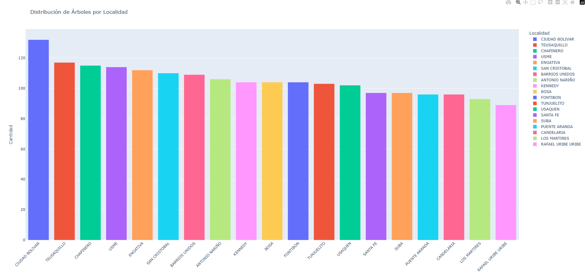
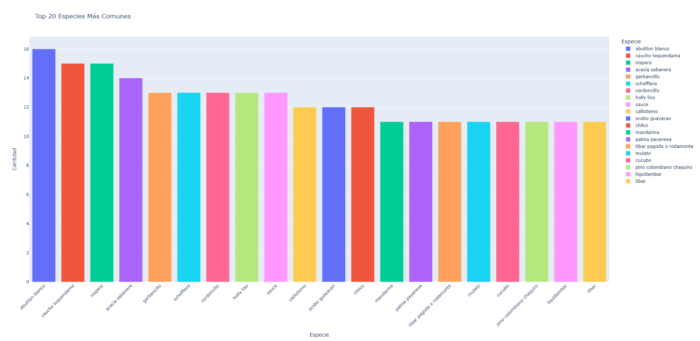
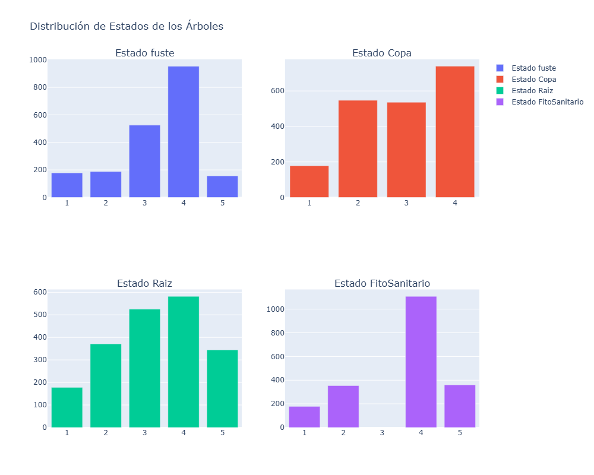
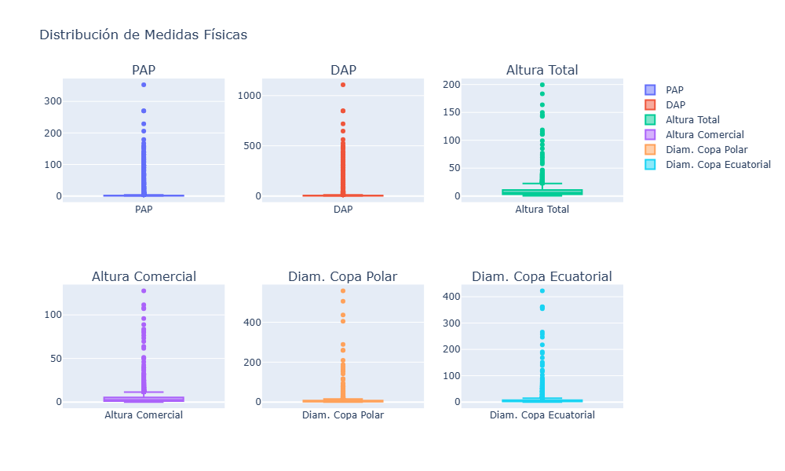
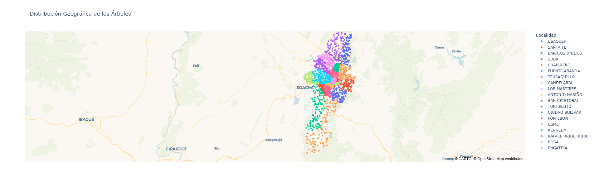
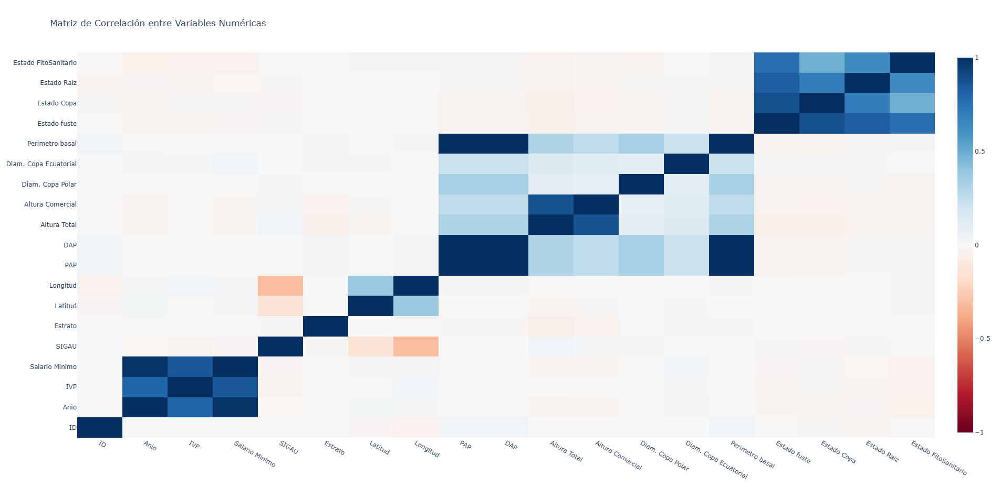
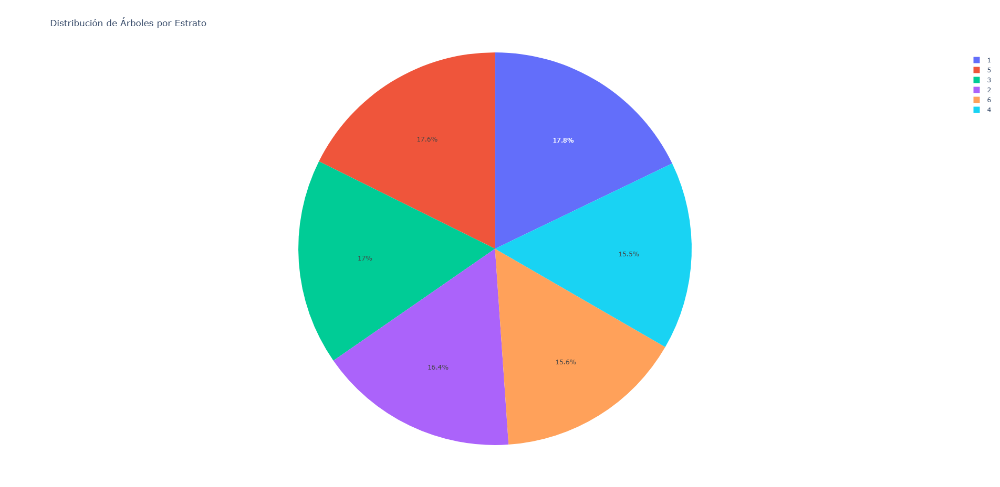
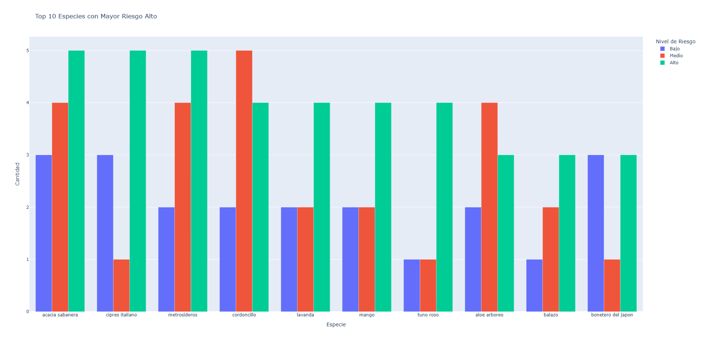
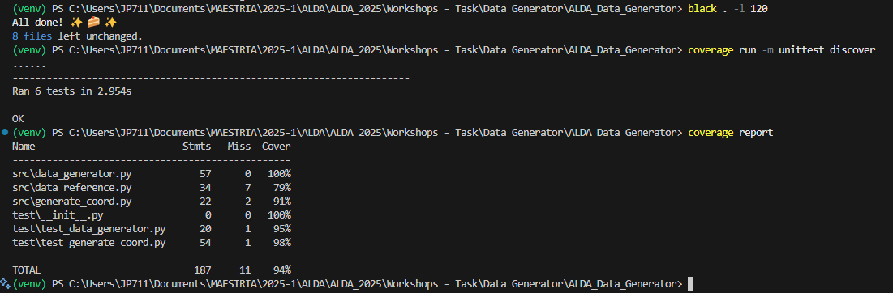

# Urban Tree Dataset Generator – Bogotá

This project aims to generate a synthetic dataset containing detailed information about the urban tree inventory in Bogotá, Colombia. The dataset includes georeferenced data and a wide range of ecological, physical, and administrative attributes relevant for environmental analysis, urban planning, and AI model training.

## Project Purpose
The goal is to simulate a realistic and structured dataset for use in academic and professional research regarding the urban forest in Bogotá. The dataset can be useful for machine learning models, statistical analysis, visualization projects, and smart city initiatives.

## Project Structure

This project simulates and generates synthetic datasets for urban tree inventories in Bogotá, Colombia. Below is the structure of the main directories and files:

ALDA_Data_Generator/ │ ├── data/ # Reference and input data (CSV, GeoJSON) │ ├── info_especies.csv # Botanical species reference │ └── localidades_bogota.geojson # Bogotá localities polygons │ ├── src/ # Source code │ ├── data_reference.py # Reference data loader and constants │ ├── data_generator.py # Main data generation logic │ └── generate_coord.py # Functions for generating random coordinates │ ├── notebooks/ # Jupyter notebooks for analysis (optional) │ ├── tests/ # Unit tests (optional) │ ├── requirements.txt # Python dependencies ├── README.md # Project documentation └── mk.md # Project structure (this file)

## Project Folder Structure

- **data/**  
  Contains reference and input data files such as CSVs for species information and GeoJSON files for locality boundaries.

- **src/**  
  Includes all source code files for data loading, generation, and coordinate simulation.

- **tests/**  
  (Optional) Unit tests for validating the functionality of the code.

- **requirements.txt**  
  Lists all Python dependencies required to run the project.

- **README.md**  
  Main documentation file with project overview and usage instructions.

## Main Files

- **data_reference.py**  
  Loads reference data (species, treatments, localities, etc.) and provides constants for the generator.

- **data_generator.py**  
  Contains the main classes and logic for generating synthetic tree data, including random attribute assignment and dataset creation.

- **generate_coord.py**  
  Generates random geographic coordinates within the boundaries of Bogotá’s localities using GeoJSON data.

- **data_analysis.py**  
  Is a script designed to analyze and visualize the synthetic datasets generated by the Data Generator. It typically includes functions for loading the generated data, performing statistical analysis (such as distributions of species, treatments, or tree conditions), and creating visualizations like histograms, bar charts, or maps. This helps users gain insights into the simulated urban tree data and validate the quality and realism of the generated datasets.


## Data Directory

- **info_especies.csv**  
  Contains botanical species information and typical measurements.

- **localidades_bogota.geojson**  
  Geospatial data for Bogotá’s localities, used for spatial simulation.

- **arboles_bogota.csv**
    
    The `arboles_bogota.csv` file is the main output of the Data Generator. It stores the complete synthetic dataset of urban trees generated for Bogotá. Each row in this CSV file represents an individual tree record, including its georeferenced location, species, physical and ecological attributes, treatment information, and administrative details.


## Dataset Overview

| Column Name             | Description                                                                 |
|-------------------------|-----------------------------------------------------------------------------|
| **ID**                  | Unique identifier for each tree record                                     |
| **Anio**                | Year the data was collected                                                |
| **IVP**                 | Tree appraisal value (Indicador de Valor Patrimonial)                      |
| **Salario Minimo**      | Minimum wage in Colombia at time of record collection                      |
| **Concepto**            | Record concept or code assigned for identification                         |
| **TipoCT**              | Type of urban infrastructure the tree belongs to                           |
| **Consecutivo**         | Consecutive internal record number                                         |
| **SIGAU**               | Urban Tree Management System reference code                                |
| **Especie**             | Scientific/common name of the tree species                                 |
| **Tratamiento**         | Silvicultural/maintenance treatment applied                                |
| **Espacio**             | Type of space where tree is located (public/private)                       |
| **Emplazamiento**       | Specific site setting (e.g., park, sidewalk)                               |
| **Estrato**             | Socioeconomic stratum of location (Colombian classification)               |
| **Localidad**           | Urban district/borough in Bogotá                                           |
| **Latitud**             | Geographic latitude coordinate (decimal degrees)                           |
| **Longitud**            | Geographic longitude coordinate (decimal degrees)                          |
| **PAP**                 | Projected tree planting area (m²)                                          |
| **DAP**                 | Diameter at Breast Height (DBH) in cm                                      |
| **Altura Total**        | Total tree height in meters                                                |
| **Altura Comercial**    | Usable trunk height in meters                                              |
| **Diam. Copa Polar**    | Canopy polar diameter in meters                                            |
| **Diam. Copa Ecuatorial** | Canopy equatorial diameter in meters                                     |
| **Perimetro basal**     | Basal perimeter of trunk in cm                                             |
| **Estado fuste**        | Trunk condition/health status (1-5 scale)                                  |
| **Estado Copa**         | Canopy condition/health status (1-5 scale)                                 |
| **Estado Raiz**         | Root system condition/stability (1-5 scale)                                |
| **Estado FitoSanitario** | Phytosanitary state (pests/diseases, 1-5 scale)                          |
| **Estado General**      | Overall health assessment (Bueno/Regular/Malo)                             |
| **Riesgo**              | Risk level (No Aplica/Bajo/Medio/Alto/Muy Alto)                                      |
| **Interes patrimonial** | Heritage/historical significance (Sí/No)                                   |
| **Autorizado**          | Authorizing entity for treatments (e.g., UAESP, JBB)                       |

## Data Sources and References

The generation of the synthetic dataset was guided by the [`data/info_especies.csv`](data/info_especies.csv)info_especies.csv file, kindly provided by Engineer Edgar Calderón, from the Subdirección de Silvicultura, Flora y Fauna Silvestre of the Secretaría Distrital de Ambiente.

This reference file contained valuable information on tree species and their corresponding dasometric characteristics (e.g., height, PAP, crown diameter), which served as a baseline model for generating realistic and coherent data within the synthetic dataset.

We extend our appreciation to Engineer Edgar Calderón and the SDA for supporting academic and research initiatives focused on urban forestry in Bogotá.

As part of the geospatial component of the dataset, this project makes use of a GeoJSON file containing the administrative boundaries of Bogotá's localities, officially known as "localidades". This file, named [`data/localidades_bogota.geojson`](data/localidades_bogota.geojson), was downloaded from the Bogotá Open Data portal (datosabiertos.bogota.gov.co), which provides public access to geographic and statistical data maintained by the city government.

This file is a GeoJSON (Geographic JSON) file containing polygon features for each of Bogotá’s 20 localities. Each polygon represents the spatial boundaries of one locality and includes metadata such as:

- LocNombre: Name of the locality (e.g., "CHAPINERO", "CIUDAD BOLÍVAR").
- OBJECTID: Internal identifier.
- SHAPE_AREA and SHAPE_LENGTH: Measurements of the polygon's area and perimeter.
- Geometrical information encoded in the "geometry" field, representing the polygon coordinates.

This file plays a crucial role in assigning synthetic geolocation data (latitude and longitude) to each tree entry. The process involves:

- Selecting a locality randomly or based on certain socioeconomic or environmental conditions (e.g., stratum).

- Extracting the polygon that corresponds to the chosen locality from the GeoJSON.

- Generating a random point within that polygon to simulate the location of the tree specimen.

- Storing the resulting latitude and longitude in the final dataset to reflect a realistic spatial distribution of trees in the urban territory.

### Creating a Virtual Environment

To create a virtual environment for this project, follow these steps:

1. Open a terminal in the project directory.
2. Run the following command to create the virtual environment:

   ```sh
   python -m venv venv
   ```
This will create a folder named [`venv`](/venv) in the project directory.

3. Activate the virtual environment:
    ```sh
    venv/bin/activate
    ```
4. Install the required dependencies:
    ```sh
    pip3 install -r requirements.txt
    ```
Importance of a Virtual Environment:
- Dependency Management: Ensures that the project uses the correct versions of libraries specified in requirements.txt.
- Isolation: Prevents conflicts between dependencies of different projects.
- Reproducibility: Makes it easier for others to set up and run the project with the same environment.

## Testing

## Tests

The `tests/` directory contains unit tests designed to ensure the correctness and reliability of the project's codebase. These tests cover the main functionalities of the data generator, including:

- **Data loading:** Verifies that reference data (such as species and localities) is loaded correctly from CSV and GeoJSON files.
- **Data generation:** Checks that the synthetic data produced by the generator meets expected formats, value ranges, and logical consistency.
- **Coordinate generation:** Ensures that randomly generated coordinates fall within the correct locality boundaries.
- **Edge cases:** Tests the behavior of the code when encountering missing data, invalid inputs, or boundary conditions.

Running these tests helps maintain code quality, facilitates future development, and ensures that the generated datasets are accurate and realistic.

## Result
## Results

All necessary research was conducted to ensure that the generated data aligns with proposed standards and accurately reflects real-world conditions. The synthetic dataset was created based on verified information provided by the official entities responsible for managing urban forestry data in Bogotá. This approach guarantees that the simulated records are coherent, realistic, and suitable for academic, professional, and analytical purposes.

Extensive testing was performed using a dataset of 5,000 records. While the generation process is robust and produces high-quality data, it can be time-consuming due to the complexity and detail required to simulate each tree entry with realistic attributes and spatial information.

## Result Analysis
A total of 2,000 synthetic data records were generated and stored in the file arboles_bogota.csv. Subsequently, the script data_analysis.py was executed to visualize and analyze the dataset.

The analysis included:

General descriptive statistics of the dataset.
Visualizations of tree distribution by locality, the most common species, tree health status, physical measurements, and socioeconomic strata.
An interactive map showing the geographic distribution of the trees.
A correlation matrix for numerical variables.
Risk analysis by species and distribution of applied treatments.
Identification of species with the highest average height and the percentage of trees with patrimonial interest.
These visualizations and analyses allowed for an exploration of the structure and characteristics of the generated data, facilitating the identification of patterns and potential areas of interest for further studies.

### Visualizations Overview

Below are the main visualizations generated during the analysis of the synthetic urban tree dataset. Each image provides insights into different aspects of the data:

### 1. Distribution of Trees by Locality



This bar chart shows the number of trees recorded in each locality of Bogotá. It helps identify which areas have higher or lower tree density in the simulated dataset.

---

### 2. Top 20 Most Common Species



This visualization displays the 20 most frequently occurring tree species in the dataset. It highlights the dominant species in Bogotá’s urban forest.

---

### 3. Tree Health Status



This set of bar charts summarizes the condition of different parts of the trees (trunk, canopy, roots, and phytosanitary state). It provides an overview of the general health of the urban trees.

---

### 4. Physical Measurements Distribution



These boxplots illustrate the distribution of key physical attributes such as height, diameter at breast height (DBH), and crown diameters. They help visualize the variability and typical ranges for each measurement.

---

### 5. Geographic Distribution Map



This interactive map shows the spatial distribution of trees across Bogotá, colored by locality. It allows for the identification of spatial patterns and potential clustering.

---

### 6. Correlation Matrix



This heatmap displays the correlation coefficients between numerical variables in the dataset. It helps identify relationships and dependencies among different tree attributes.

---

### 7. Socioeconomic Stratum Distribution



This pie chart shows the proportion of trees located in each socioeconomic stratum. It provides insights into the distribution of urban forestry resources across different social groups.

---

### 8. Risk by Species



This grouped bar chart presents the risk levels (low, medium, high) for the top 10 species with the highest number of high-risk trees. It helps prioritize species for monitoring and intervention.


##  Coverage

Coverage generates a report showing what percentage of each code file was covered during testing. The report also shows a summary of the total coverage for the entire project. In this case, 94% of the code was covered during testing.

